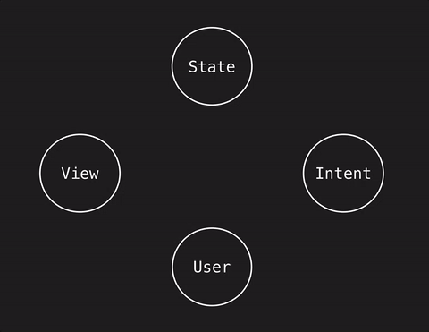

# Model View Presenter (MVP)

+++

|    Model   | View | Presenter |
|------------| ---- | --------- |
| Structs | User interaction |Sits between View and Model |
| Classes | Dumb (No Logic) |No knowledge of view, because view is implemented via an interface |
| Business Logics | Activity/Fragment on Android or ViewController on iOS | Act as the middle man between model and view |
|||

+++
## Sample

+++
### Model
```kotlin
class Account() {
	var money = 0

	fun addAndShowMoney(additionMoney: Int): Int {
		this.money = this.money + additionMoney
		return money
	}
}

```
@[4-7](Business Logic here)

+++
### View
```kotlin
interface AccountView {
	fun showMoney(money: Int)
}
```
@[1](Interface)
@[2](Virtual Function)
+++
```kotlin
class AccountActivity: Activity, AccountView {
	...
	override fun showMoney(money: Int){
		textView.text = money
	}
}
```
@[1, 3-5](Activity/ViewController that implements the AccountView and overrides its function)
+++
### Presenter 
```kotlin
class AccountPresenter(view: AccountView) {
	lateinit var account: Account 

	init {
		loadAccountFromInternet()
	}

}
```
@[1](AccountPresenter takes in the view interface)
@[2, 4-6](It has an Account that loads from the internet)
+++
### View
```kotlin
class AccountActivity: Activity, AccountView {
	private val presenter: AccountPresenter(this)

	fun onCreate(...){
		...
		button.onClickListener = {
			presenter.addMoney(100)
		}
	}

	override fun showMoney(money: Int){
		textView.text = money
	}
}
```
@[2](Pass in itself to the AccountPresenter as the AccountView)
@[6-8](Button click)
@[11-13](result from the presenter)
+++
### Presenter 
```kotlin
class AccountPresenter(view: AccountView) {
	lateinit var account: Account 

	init {
		loadAccountFromInternet()
	}

	fun addMoney(additionMoney: Int){
		val result = account.addAndShowMoney(additionMoney)
		view.showMoney(result)
	}
}
```
@[8-11](addMoney function triggered by the view)
@[10](Pass the result to view interface)
+++
---

# Model View Intent (MVI)
+++
@snap[west]

@snapend

@snap[east span-40 text-left]
@box[](👆🏻(button click/event))
@box[](🚓 Intent/Action))
@box[](🏭 Reducer (process action))
@box[](🏬 Store/States)
@box[](📺 View (Subscribed to the changes to store/states))

@snapend

+++
```kotlin
class AccountStore() {
	@Observable
	var state = mapOf<String, Any>("balance", 0)
	val observers: ArrayList<ObserverView> = arrayListOf()

	fun addObservers(view: ObserverView){
		observers.add(view)
	}

	fun notify() {
		observers.notifyAll()
	}


}
```
@[2-3](An observable state, allow us to monitor changes)
@[6-8](Add observer)
@[9-11](Notify state changes to observer)
+++
User clicks button
```kotlin
data class Action(val type = "ADDITION", val money: Int)

button.onClick {
	AccountStore.sendAction(Action("ADDITION", 10))
}

```
@[1](An Action data class)

+++
```kotlin 
fun actionReducer(state: Map = mapOf(), action: Action){
	val newState = mutableMapOf<String, Any>()

	when (action.type){
	 "ADDITION" -> {
	 	newState.putAll(state)
	 	newState["balance"] = newState["balance"] as Int + action.number
	 	return newState
	 }
	 default -> state
	}
}

// Then notify the view via the AccountStore observer
```

+++
### Pros
* Clear
* Uni direction, no race condition.
* Because we are not modifying the state. Meaning we can do time travel debugging.

+++
### Cons
* Tedious
* Steep learning curve

---
